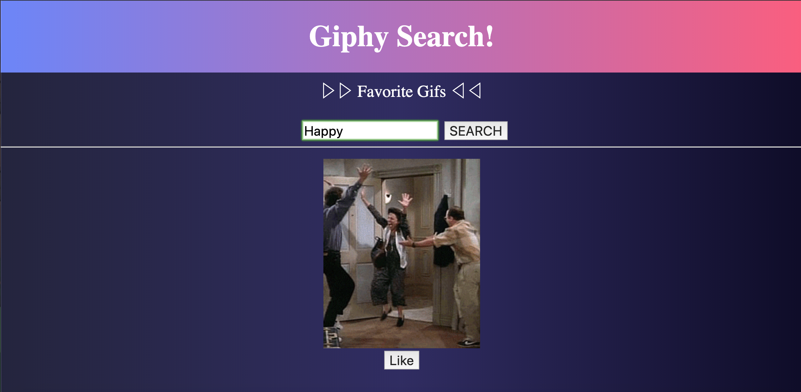
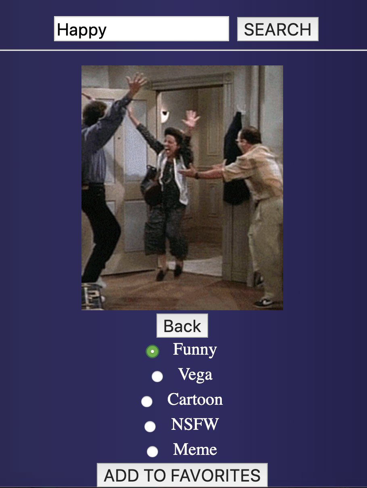
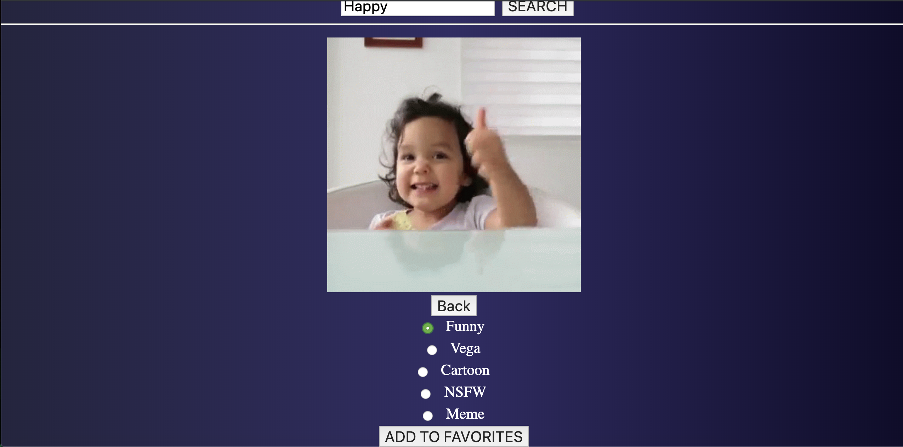
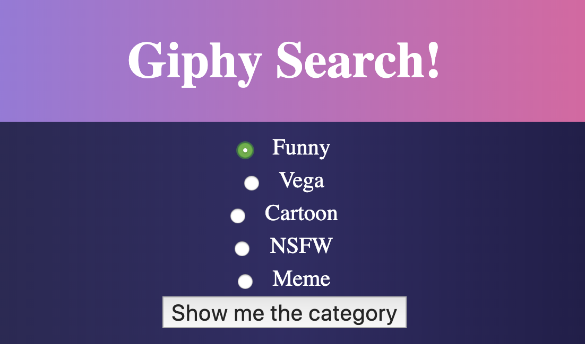

# Giphy API with Saga 

## Description

Duration: 2 Days

What problem did you solve? How did you solve it?
In this project, my group and I set out to create an application that sends an axios request to the Giphy API database via sagas and store the response within a reducer. Users are able to use key words to search for different gif images from giphy within our applicaiton. The users are also able favorite differeny gifs that they found through the search feature and save it to their favorited category.

<!-- To see the fully functional site, please visit: DEPLOYED VERSION OF APP -->

## Wireframe

### Landing Page

### Add Favorited Image to Funny Category

### Add Another Favorited Image to Funny Category

### Funny Page with Favorited Images

### Images within Funny Page

### Prerequisites

https://nodejs.org/en/
https://developers.giphy.com/docs/api#quick-start-guide

## Installation
This is a step by step list for how another developer could get this project up and running.

1. Create a database named giphy_search_favorites
2. The queries in the tables.sql file are set up to create all the necessary tables and populate the needed data to allow the application to run correctly. The project is built on Postgres, so you will need to make sure to have that installed. I recommend using Postico to run those queries as that was used to create the queries.
3. Open up your editor of choice and run an npm install
4. Run npm run server in your terminal
5. Run npm run client in your terminal
6. The npm run client command will open up a new browser tab for you!

## Usage
You can use this applicaiton to learn how to access different API's.

## Built With
* SERN Stack
    * SQL
    * Express
    * React
    * Redux
    * Node
    * Material UI
    * Postgres
    * Postico

## Acknowledgement
Thanks to Prime Digital Academy in Minneapolis who equipped and helped me to make this application a reality. Special thanks to https://github.com/AwrenNuit, https://github.com/elmiabdirahman, and https://github.com/cmdornfeld that helped with different features and components.

## Support
If you have suggestions or issues, please email me at harrisonnguyen517@gmail.com
